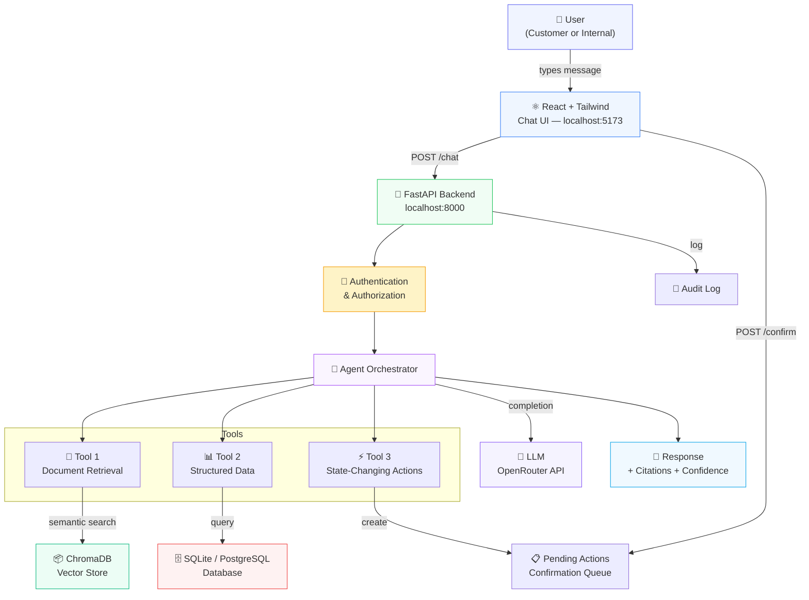
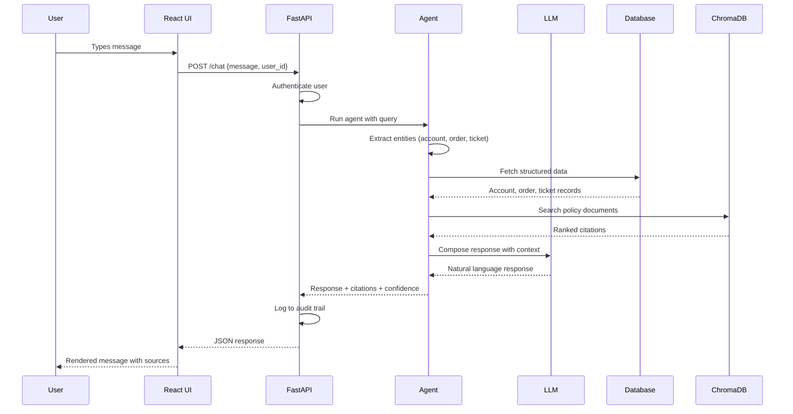

# ParcelPilot AI Support Agent

Production-oriented AI support system for ParcelPilot's B2B logistics platform. Combines RAG, structured operational data, customer-specific rules, authorization, agentic multi-step reasoning, and human-in-the-loop actions.

## Architecture



### Data Flow



## Tech Stack

| Component | Technology |
|---|---|
| Backend | FastAPI |
| Frontend | React 18 + Vite + Tailwind CSS |
| Agent | Custom orchestration (LangGraph-style) |
| Database | SQLite (swappable to PostgreSQL) |
| Vector Store | ChromaDB |
| LLM | OpenRouter (Nemotron 3 Super 120B) via OpenAI-compatible API |
| ORM | SQLAlchemy |
| PDF Parsing | PyMuPDF |
| Excel Parsing | openpyxl |
| Markdown | react-markdown |

## Setup

### Prerequisites

- Python 3.11+
- Node.js 18+
- npm

### Backend

```bash
# 1. Create virtual environment
python -m venv .venv
.venv\Scripts\activate        # Windows
# source .venv/bin/activate   # Linux/Mac

# 2. Install dependencies
pip install -r requirements.txt

# 3. Configure environment
cp .env.example .env
# Edit .env with your API key

# 4. Place data files in data/raw/
# (6 PDFs + 1 Excel workbook)

# 5. Start backend server
uvicorn app.main:app --reload --port 8000
```

### Frontend

```bash
# 1. Install dependencies
cd frontend
npm install

# 2. Start dev server
npm run dev
```

Frontend runs on `http://localhost:5173`. Backend runs on `http://localhost:8000`.

## Environment Variables

### Backend (.env)

| Variable | Default | Description |
|---|---|---|
| `LLM_PROVIDER` | openrouter | LLM provider |
| `LLM_MODEL` | nvidia/nemotron-3-super-120b-a12b:free | Model name |
| `OPENROUTER_API_KEY` | — | API key |
| `OPENROUTER_BASE_URL` | https://openrouter.ai/api/v1 | API base URL |
| `DATABASE_URL` | sqlite:///./parcelpilot.db | Database connection |
| `EMBEDDING_MODEL` | all-MiniLM-L6-v2 | Embedding model |
| `ENVIRONMENT` | development | Environment |

### Frontend (.env)

| Variable | Default | Description |
|---|---|---|
| `VITE_API_URL` | http://localhost:8000 | Backend API URL |

## Data Ingestion

The ingestion pipeline processes:
- **Excel workbook** → Accounts, Orders, Tickets tables
- **6 PDFs** → ChromaDB vector store with metadata

Each PDF chunk includes:
- `document_name`, `document_type`, `version`, `status`
- `effective_date`, `customer_account_id`
- `source_priority` (authority ranking)
- `page_number`, `section`

## Authentication

Mock users for assessment:

| User | Role | Account |
|---|---|---|
| `customer_northstar` | Customer | ACCT-001 |
| `customer_lumenworks` | Customer | ACCT-002 |
| `support_agent` | Internal | — |
| `operations_admin` | Internal | — |

Users can be switched from the header dropdown in the React UI.

## Tool Architecture

### Tool 1: Document Retrieval
Search policies, agreements, SOPs, product docs. Returns ranked citations with authority scores.

### Tool 2: Structured Data
Query accounts, orders, tickets, SLA status. Authorization enforced at repository layer.

### Tool 3: State-Changing Actions
Create escalations, update tickets, create follow-up tasks. All require explicit confirmation before execution.

## Source Authority

| Priority | Source | Status |
|---|---|---|
| 90 | Northstar / LumenWorks Agreement | Active |
| 80 | Support Policy v3 | Current |
| 75 | Cancellation SOP v4 | Current |
| 70 | Product Operations Guide | Current |
| 20 | Support Policy v2 | Deprecated |
| 10 | Historical tickets | Context only |

Customer agreements override general policies. Historical tickets may contain incorrect information.

## Security Model

- **Authorization enforced at repository layer**, not just LLM prompts
- **Cross-account isolation**: customers scoped to own account
- **Retrieved documents treated as data**, not instructions
- **All state changes require explicit confirmation**
- **Idempotent actions**: duplicate confirmations rejected
- **Input sanitization**: prompt injection detection, length limits

## API Endpoints

| Method | Endpoint | Description |
|---|---|---|
| POST | `/chat` | Send message to agent |
| POST | `/actions/{id}/confirm` | Confirm pending action |
| GET | `/tickets/{id}` | Get ticket details |
| GET | `/orders/{id}` | Get order details |
| GET | `/sources/{id}` | Get source metadata |
| GET | `/ops/issues` | Proactive issue detection (internal only) |
| GET | `/health` | Health check |

## Frontend Features

- **Chat interface**: User messages right-aligned (purple), AI left-aligned (white)
- **Markdown rendering**: Bold, bullets, code blocks via react-markdown
- **Parcel cards**: Structured order/status data rendered as cards
- **Citations**: Collapsible source references per message
- **Tool calls**: Expandable list of tools used per response
- **Conflicts**: Source conflict warnings
- **Confidence badges**: High (green), Medium (yellow), Low (red)
- **Confirm actions**: Inline buttons for escalation/task confirmation
- **User selector**: Switch between 4 roles from header
- **New Chat**: Clears session, generates new session ID
- **Session persistence**: localStorage for session ID
- **Responsive**: Desktop + mobile layouts
- **Animations**: Fade-in messages, animated typing indicator
- **Error handling**: Retry button on failures

## Testing

```bash
# Unit tests
python -m pytest tests/ -v

# Comprehensive validation
python scripts/validate_all.py

# Dashboard/observability checks
python scripts/check_dashboard.py

# Frontend build
cd frontend && npm run build
```

Test coverage:

| Suite | Tests | Coverage |
|---|---|---|
| pytest unit tests | 65 | Authorization, access control, source reliability, actions, agent extraction, prompt injection, retrieval |
| Comprehensive validation | 80 | Chat+RAG+Excel, 3 tools, multi-step agent, access control, actions, precedence, error handling, issue detection, observability |
| Dashboard validation | 38 | Streamlit features, logging setup, structured logs |
| **Total** | **183** | **183/183 passing** |

## Project Structure

```
parcelpilot/
├── app/
│   ├── api/routes.py              # FastAPI endpoints
│   ├── agent/graph.py             # Agent orchestration + LLM calls
│   ├── agent/prompts.py           # System prompts
│   ├── agent/state.py             # Agent state dataclass
│   ├── tools/documents.py         # Tool 1: Document retrieval
│   ├── tools/operations.py        # Tool 2: Structured data
│   ├── tools/actions.py           # Tool 3: State-changing actions
│   ├── data/models.py             # SQLAlchemy ORM
│   ├── data/repository.py         # Auth-enforced data access
│   ├── data/ingestion.py          # PDF + Excel ingestion
│   ├── security/auth.py           # Mock auth + authorization
│   ├── services/retrieval.py      # Document search
│   ├── services/reliability.py    # Source authority ranking
│   ├── services/issue_detection.py # Proactive issue detection
│   ├── vector/store.py            # ChromaDB wrapper
│   ├── config.py                  # Settings
│   └── main.py                    # FastAPI app + CORS
├── frontend/
│   ├── src/
│   │   ├── components/
│   │   │   ├── ChatHeader.jsx     # Header with logo, user selector, status
│   │   │   ├── ChatInput.jsx      # Auto-growing textarea + send button
│   │   │   ├── ChatMessage.jsx    # Message bubbles + citations + actions
│   │   │   ├── ErrorMessage.jsx   # Error display with retry
│   │   │   ├── ParcelCard.jsx     # Structured parcel/order card
│   │   │   ├── TypingIndicator.jsx # Animated typing dots
│   │   │   └── WelcomeScreen.jsx  # Empty state + suggestion cards
│   │   ├── hooks/useChat.js       # Chat state + session management
│   │   ├── services/api.js        # API service layer
│   │   ├── App.jsx                # Main layout
│   │   ├── main.jsx               # Entry point
│   │   └── index.css              # Tailwind base styles
│   ├── package.json
│   ├── vite.config.js
│   ├── tailwind.config.js
│   └── .env
├── scripts/
│   ├── validate_all.py            # 80-check comprehensive validation
│   ├── check_dashboard.py         # Dashboard + observability checks
│   ├── test_llm.py                # LLM connection diagnostic
│   └── test_demo.py               # Demo scenario tests
├── tests/
│   ├── test_actions.py            # Action confirmation tests
│   ├── test_agent_workflow.py     # Entity extraction tests
│   ├── test_api.py                # API endpoint tests
│   ├── test_authorization.py      # Auth + access control tests
│   ├── test_data_access.py        # Data scoping tests
│   ├── test_prompt_injection.py   # Security tests
│   ├── test_retrieval.py          # RAG retrieval tests
│   └── test_source_reliability.py # Source ranking tests
├── data/raw/                      # Source files (Excel + PDFs)
├── .env                           # Environment config
├── requirements.txt               # Python dependencies
└── README.md
```

## How Frontend Communicates with Backend

1. User types a message in the React chat input
2. `useChat` hook calls `sendMessage()` from `services/api.js`
3. `api.js` sends `POST http://localhost:8000/chat` with `{ message, user_id }`
4. FastAPI receives request, authenticates user, runs agent
5. Agent retrieves documents, queries data, calls LLM
6. Response returned with citations, tool calls, confidence, pending actions
7. React renders the response with markdown, expandable sources, and action buttons
8. If action confirmation is needed, user clicks "Confirm Action" button
9. Frontend sends `POST http://localhost:8000/actions/{id}/confirm`
10. Backend executes action and returns result

## License

Internal assessment project.
